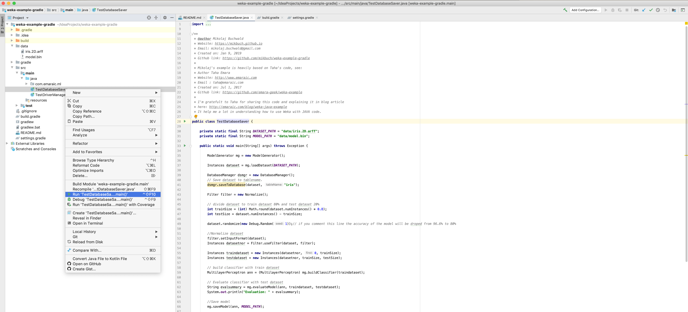

# How to use Weka with JAVA code

This repository contains a minimal example no how to use Weka with JAVA code.

## Inspiration and modifications

The example is based on [this repository](https://github.com/tahaemara/weka-example) and [this article](http://emaraic.com/blog/weka-java-example) by Taha Emara. My modifications are that, first, it was ported to Gradle, which is easier to use for me out-of-the-box in IntelliJ IDEA. Second, some things are simplified and file names changed for better readability.

## Running the code

Onece you will synchronize gradle (to get project dependencies), you have to run `TestDatabaseServer` (_src/java/TestDatabaseSaver.java_). See screenshot below:

Optionally, your data can be saved to the database (given that you have a database instance running locally).

## Notes from my previous version:

### ARFF files and databases

Simple and clear examples of how to load/read dataset from ARFF file into data Instance in Weka. Novum here is the database connection handling. It is achieved using two different approaches:
* one is DataSaver object that allows connecting to the database and creating table with a given name;
* the other is using (JDBC) DriverManager (Connection, Statement and ResultSet) &ndash; the resulting ResultSet object is printed to the console.

Below is the content of README.md of the original repository with this example by tahaemara ([weka-example](https://github.com/tahaemara/weka-example), https://github.com/tahaemara/weka-example):

> ### How to use Weka in your Java code?
> 
> The objective of this code is to generate a model from ARFF dataset file (iris.2D.arff) and to classify a new instance with this model using Weka API in Java.
> 
> 
> For more details read this article: http://emaraic.com/blog/weka-java-example
